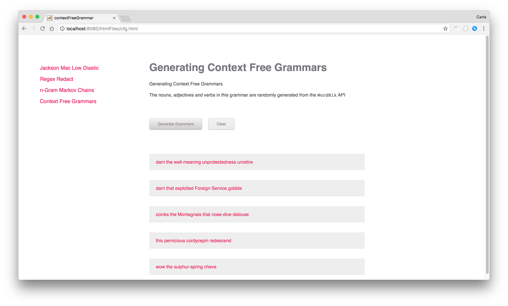
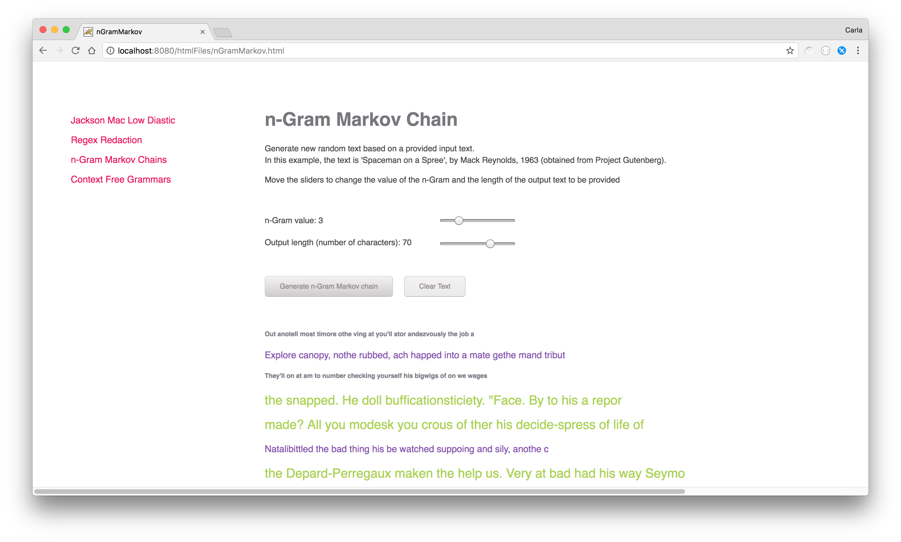
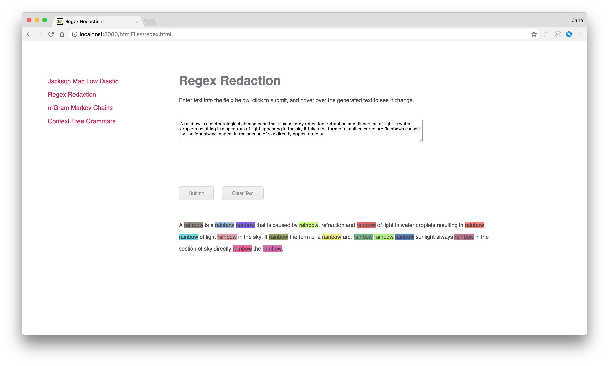
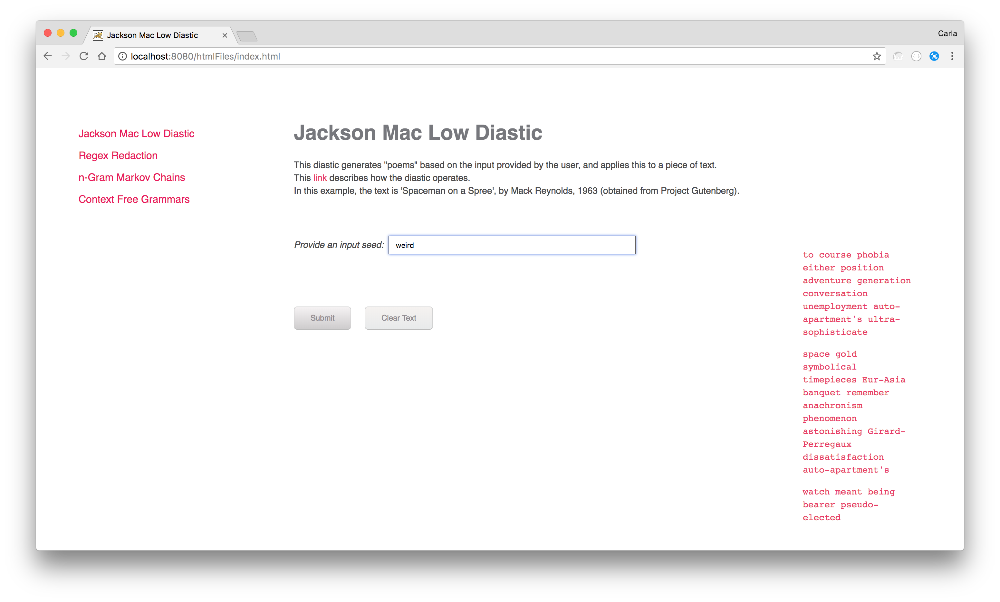

# P5js Text Generators #

This is a website that contains a number of generative text projects, based on Daniel Shiffman's 2016-2017 "Programming from A to Z" course: http://shiffman.net/a2z/

The following generative text strategies have been implemented:
* Jackson Mac Low Diastic
* N-Gram Markov Chain
* Context Free Grammer
* Regex Text Manipulation

The website can be viewed via the following URL: https://carla-de-beer.github.io/Text-Generators/

 

  
  
  
  

